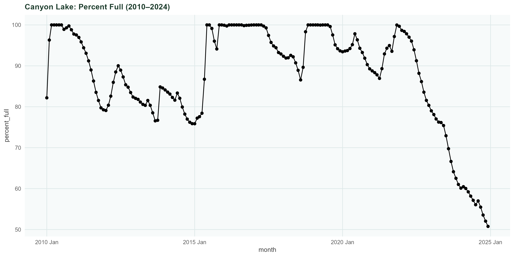
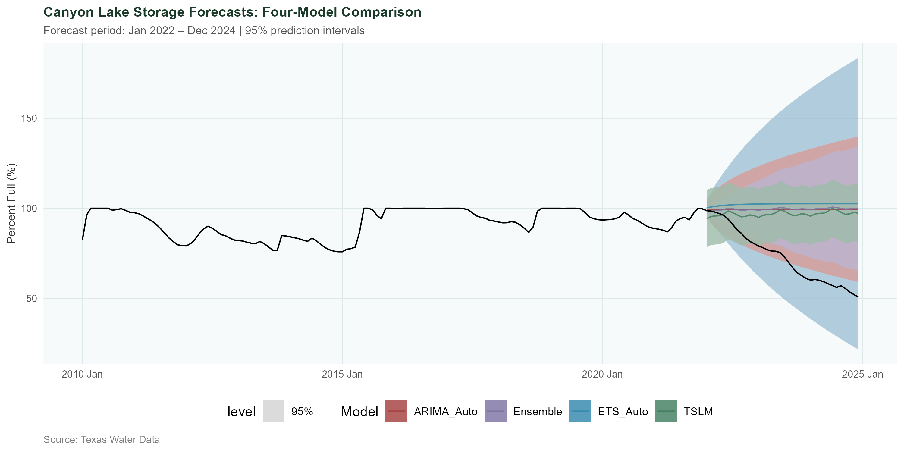

# Forecasting Canyon Lake Reservoir Storage

**Authors:** Amanda Marrero
**Institution:** Woods College of Advancing Studies, Boston College  
**Course:** Applied Analytics — Master's Program  
**Data Source:** Water Data for Texas (https://www.waterdatafortexas.org/reservoirs/individual/canyon.csv)

## Project Overview
This project forecasts monthly Canyon Lake reservoir storage levels in Central Texas using time series forecasting methods. The goal is to evaluate model performance and provide insight into regional water supply planning under drought and population growth pressures.

## Business Context
Canyon Lake is an important water source for Central Texas communities, including regional wholesale water agreements. Reliable storage forecasts can help stakeholders understand short-term supply risk and support drought planning.

## STL Decomposition

The STL decomposition highlights:
- strong seasonal behavior
- long-term storage decline periods
- irregular drought-driven variation




## Forecast Comparison

Four forecasting models were compared using a 36-month holdout period.

ARIMA was selected as the final model because it produced:
- competitive forecast accuracy
- clean residual diagnostics
- statistically reliable prediction intervals



## Methods Used

- Time series decomposition (STL)
- ETS modeling
- ARIMA modeling
- Time Series Linear Regression (TSLM)
- Ensemble forecasting
- Residual diagnostics
- Ljung-Box testing
- Train/test validation (80/20 split)

Monthly percent-full observations for Canyon Lake were obtained from the Texas Water Data portal (waterdatafortexas.org) covering January 2010 through December 2024, yielding 180 observations. Daily observations were aggregated to monthly averages and structured as a tsibble object in R using the fpp3 and tidyverse packages. The dataset was divided into a training set (January 2010 – December 2021, n = 144) and a test set (January 2022 – December 2024, n = 36), reflecting an approximate 80/20 split. All model fitting, transformation assessment, and stationarity testing were performed exclusively on the training data. A Box-Cox transformation was assessed using the Guerrero method but was not applied, as the bounded nature of the percent-full variable (0–100%) limits the appropriateness of variance-stabilizing transformations. Seasonal differencing and unit root tests (KPSS) were used to assess stationarity prior to ARIMA specification.


## Tools
- R
- fpp3
- tsibble
- fable
- feasts
- ggplot2

## Key Results
- ARIMA produced the strongest residual diagnostics
- TSLM achieved lower raw RMSE but showed significant autocorrelation
- Reliable uncertainty intervals are critical for drought-stage planning
- Seasonal storage patterns strongly influence forecast behavior

## Repository Structure

```text
canyon-lake-forecasting/
│
├── data/
|    └── prcoessed/
|       └── canyon_monthly.csv
|       └── full_time_series.png
│   └── raw/
│       └── canyon_lake_storage.csv
|
├── figures/
│   ├── acf_pacf_full.png
│   ├── acf_pacf_training.png
|   ├── forecast_comparison.png
|   ├── full_time_series.png
|   ├── stl_decomp_full.png
|   ├── stl_decomp_training.png
│
├── outputs/
│   ├── arima_model_report.txt
│   ├── ets_model_report.txt
|   ├── ljung_box_accuracy.csv
|   ├── model_accuracy.csv
|   ├── stationarity_checks.csv
|   ├── tslm_model_report.txt
│
├── reports/
│   └── final_analysis_poster.pdf
│   └── final_analysis.html
│   └── final_analysis.pdf
│   └── final_analysis.Rmd
|
├── scripts/
│   ├── 01_download_data.R
│   ├── 02_clean_data.R
│   ├── 03_theme_canyon.R
|   ├── 04_exploratory_analysis.R
|   ├── 05_modeling.R
```

## Final Model
The ARIMA model was selected due to stronger residual diagnostics, including a Ljung-Box test result suggesting residuals approximated white noise.

## Future Work
Future improvements could include external predictors such as precipitation, drought indices, ENSO indicators, or NOAA climate outlooks.